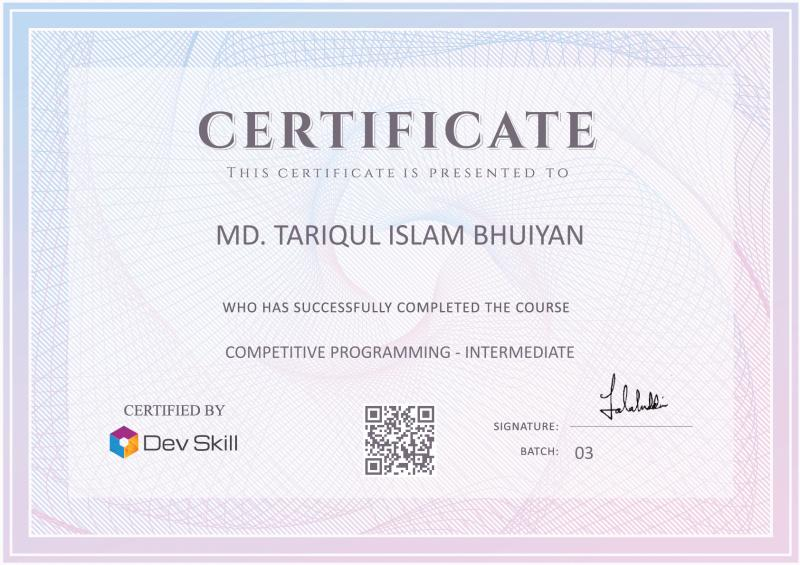

# Competitive Programming Intermediate
# Certificate

# Course Details

## Class 1 - Complexity
- Time/Memory Complexity, examples of nested loops and recursions
## Class 2 - STL
- introduction, mechanism, library functions
- vector
- Stack/queue/deque
- Priority Queue
- set/map/multi/unordered
## Class 3 - Binary Search
- Binary Property
- Lower and upper bound
- Using binary property in complex problems
## Class 4 - Ternary Search
- Ternary Property
- Using ternary property in complex problems
## Class 5 - Recursion
- Recursive equation
- Divide and Conquer
- Quick select
- Inversion count
## Class 6 - Sorting
- Recap
- Merge sort
- Quick sort
## Class 7 - String
- Substring, Subsequence, substring, palindrome, anagram recap
- Matching
- Hashing
## Class 8 - Greedy
- Prove/disprove greedy approach
- Task sheduling
- Fractional knapsack
- Coin Change
- And many more
## Class 9 - Number Theory
- Sieve of Eratosthenes
- Factorization
- Fermat's little theorem
- Modular Arithmetic
- Totient function
## Class 10 - Disjoint set union
- Mechanism
- Various applications
## Class 11 - Graph theory
- Introduction and definitions
- Storing graphs
## Class 12 - Graph Travarsal and shortest path
- DFS/BFS
- Various properties and applications
- Dijkstra
## Class 13 - Backtrack
- Brute force
- Permutation generation
- Graph coloring
## Class 14 - Dynamic programming
- Introduction, properties, states
- Ancestors of DP: Fibonacci, Factorial, nCr
- Classics and variations
## Class 15 - Segment Tree
- Basic segment Tree
